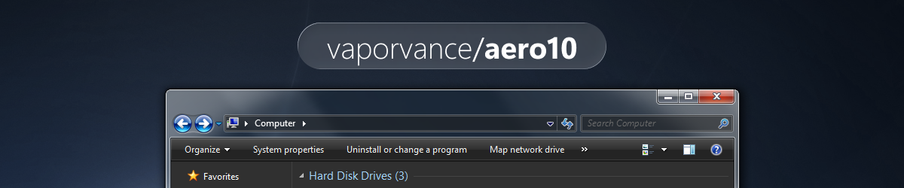

    <picture>
      <source media="(prefers-color-scheme: light)" srcset=".github/banner/banner-light.png" />
      
  </picture>

<h1 align="center">
  Aero10 / Aero10.1
</h1>

  A collection of custom themes that brings 'Windows Aero' appearance from various eras to the modern version of Windows

<h3 align="center">
  <a href="#Roadmap">Roadmap</a>
  •
  <a href="#compatibility">Compatibility</a>
  •
  <a href="#Installation">Installation</a>
  •
  <a href="#credits">Credits</a>
   <!--
  •
  <a href="#Credits">Credits</a> -->
</h3>

## Aero10.1

Aero10.1 themes are targeting to be work on **Windows 11**. Check DeviantArt page for more info and screenshot.

| Name | Description | Version | Link |
| - | - | - | - |
| Aero10.1: Seven | A full port of Windows 7 theme. Dark mode included | v1.0.0 | [a10p1-seven.zip](https://github.com/vaporvance/aero10/releases/download/a10.1-seven-v1.0.0/a10p1-seven.zip) |
| Gray7 | A full dark mode theme based on Windows 7 appearance | v1.0.0 | [gray7.zip](https://github.com/vaporvance/aero10/releases/download/a10.1-seven-v1.0.0/gray7.zip) |

## Aero10

Aero10 themes are targeting to be work on **Windows 10**. Check DeviantArt page for more info and screenshot.

> [!WARNING]
> Do not expect any Aero10 update in the future except for critical update as my computer is not capable for Windows 10 anymore. Decided to upload it here just for archival purpose in case if DeviantArt goes wrong.

| Name | Description | Link |
| - | - | - |
| Aero10: Seven | Windows 7 theme  |  • [aero10-seven.zip](https://github.com/vaporvance/aero10/releases/download/a10-reset/aero10-7000.zip)|
| Aero10: Vista | Windows Vista theme |  • [aero10-vista.zip](https://github.com/vaporvance/aero10/releases/download/a10-reset/aero10-vista.zip)|
| Aero10: Metro | Windows 8/8.1 theme  | • [aero10-metro.zip](https://github.com/vaporvance/aero10/releases/download/a10-reset/aero10-metro.zip)|
| Aero10: 7000 | Windows 7 beta (Build 7000) theme | • [aero10-7000.zip](https://github.com/vaporvance/aero10/releases/download/a10-reset/aero10-7000.zip)|

## Roadmap

Here is the roadmap of this project. Please do not ask for ETA.

| Name | Progress |
| -------- | -------- |
| Aero10.1: Seven | ✅ Completed |
| Gray7 | ✅ Completed |
| Aero10.1: Metro | 📌 Planned |
| Gray8 & Gray8.1 | 📌 Planned |
| Aero10.1: Vista | ❌ Not Planned  |
| All Aero10 themes | ❌ Discontinued |

## Compatibility
**Aero10** is designed to be working on following Windows 10 version 

Click to expand

 

| Name | Version |
| -------- | -------- |
| Windows 10 May 2019 Update | 1903 |
| Windows 10 November 2019 Update | 1909 |
| Windows 10 May 2020 Update | 2004 |
| Windows 10 October 2020 Update | 20H2 |
| Windows 10 May 2021 Update | 21H1 |
| Windows 10 November 2021 Update | 21H2 |
| Windows 10 2022 Update | 22H2 |

**Aero10.1** is designed to be working on following Windows 11 version

Click to expand

 

| Name | Version |
| -------- | -------- |
| Windows 11 2022 Update | 22H2 |
| Windows 11 2023 Update | 23H2 |
| Windows 11 2024 Update | 24H2 |
| Windows 11 2025 Update | 25H2 |
| Future Windows version | vNext* |

<small>**Aero10.1 were based on Win11 28000 msstyle, it should be compatible. Though it never been tested.*

**In technically Aero10.1 themes are applyable on Windows 10 but not recommend*</small>

## Installation

1. Patch your system to enable custom theme working **(Choose only one)** with 
    - [UltraUXThemePatcher](https://mhoefs.eu/software_uxtheme.php?lang=en)
    - [SecureUxTheme](https://github.com/namazso/SecureUxTheme)
    - [UXTheme hook](https://windhawk.net/mods/uxtheme-hook) Windhawk mod
2. Extract the downloaded zip and place the contents in C:\Windows\Resources\Themes
3. Apply the theme through Windows Settings > Personalization page

The theme should apply now, if the theme is not  working, check if your system have been patched correctly
### Things to do after applying the theme

Windows Vista-styled theme setup

4. Enable Aero glass and Windows Vista title bar button style by installing [OpenGlass](https://github.com/ALTaleX531/OpenGlass) or [OpenGlass fork with frame highlights](https://github.com/tetawaves/OpenGlass) and a Windows Vista preset
5. Install [Windhawk](https://windhawk.net) with these following mods
    - <b>You need to read every mod's readme carefully to get it installed correctly, not just click install</b>
    - (Windows 10 only) Aerexplorer. Need further tweaks in mod settings. Windows 11 user see below
    - Eradicate Immersive Menu
    - UIFILE Override
    - Windows 7/8.x Alt+Tab Loader
    - Other mods can be installed depend on your needs
6. Taskbar and Start Menu
    - StartIsBack++ or StartAllBack (paid)
    - [Explorer7](https://github.com/world-windows-federation/explorer7) for taskbar
    - RetroBar + OpenShell with your preferred theme
7. Restart Windows Explorer once to prevent any error

Windows 7-styled theme setup

4. Enable Aero glass and Windows 7 title bar button style by installing [OpenGlass](https://github.com/ALTaleX531/OpenGlass) or [OpenGlass fork with frame highlights](https://github.com/tetawaves/OpenGlass) and a Windows 7 preset
5. Install [Windhawk](https://windhawk.net) with these following mods
    - <b>You need to read every mod's readme carefully to get it installed correctly, not just click install</b>
    - (Windows 10 only) Aerexplorer. Need further tweaks in mod settings. Windows 11 user see below
    - Eradicate Immersive Menu
    - UIFILE Override
    - Windows 7/8.x Alt+Tab Loader
    - Other mods can be installed depend on your needs
6. Taskbar and Start Menu
    - StartIsBack++ or StartAllBack (paid)
    - [Explorer7](https://github.com/world-windows-federation/explorer7)
    - RetroBar + OpenShell with your preferred theme
    - (Windows 11 only) [Windows 11 Taskbar Styler](https://windhawk.net/mods/windows-11-taskbar-styler) Windhawk mod with 'Windows 7' option in mod settings
7. Restart Windows Explorer once to prevent any error

Windows 8-styled theme setup

4. Enable Windows 8 title bar style by installing [OpenGlass](https://github.com/ALTaleX531/OpenGlass) or [OpenGlass fork with frame highlights](https://github.com/tetawaves/OpenGlass) and a Windows 8 preset
5. Install [Windhawk](https://windhawk.net) with these following mods
    - <b>You need to read every mod's readme carefully to get it installed correctly, not just click install</b>
    - (Windows 10 only) Aerexplorer. Need further tweaks in mod settings. Windows 11 user see below
    - Eradicate Immersive Menu
    - UIFILE Override
    - Windows 7/8.x Alt+Tab Loader
    - Other mods can be installed depend on your needs
6. Taskbar and Start Menu
    - StartIsBack++ or StartAllBack (paid)
    - [Explorer7](https://github.com/world-windows-federation/explorer7) for taskbar
    - RetroBar + OpenShell with your preferred theme
7. Restart Windows Explorer once to prevent any error

### Windows 11-specific setup

21H2-24H2 Command bar-styled setup

- To get Aerexplorer working, you need to replace explorerframe.dll with the one from build 21332 and use [this fork of Aerexplorer](ss)

25H2++ Command bar-styled setup

- Replacing explorerframe.dll with 21332 one cause Explorer to crash, so there is no method to get Aerexplorer working yet. Sorry

## Credits
<!--
- [sdasfasfasf](test) for a Windows 7 OpenGlass preset
- [sdasfasfasf](test) for a Windows 8 OpenGlass preset
- [sdasfasfasf](test) for a Windows Vista OpenGlass preset
- [sdasfasfasf](test) for an Aerexplorer fork for Windows 11  -->
- Microsoft for original themes, wallpapers from Windows Vista, Windows 7 and Windows 8/8.1
- [ojask](https://github.com/ojask) for Aero10: Vista Control Panel Sidebar idea
	
## Licensing
This project distributed under Creative Commons Attribution-NonCommercial-ShareAlike 4.0 License, See License tab for more information.

Windows Vista, Windows 7, Windows 8, Windows logo are trademarks/registered trademarks of Microsoft.

## Support
I just learn to setup Ko-fi yesterday

